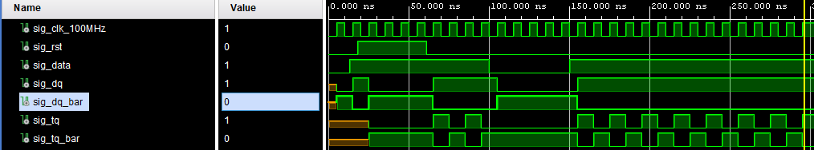

# Lab 5: Martin Olšiak

### D & T Flip-flops

1. Screenshot with simulated time waveforms. Try to simulate both D- and T-type flip-flops in a single testbench with a maximum duration of 200 ns, including reset. Always display all inputs and outputs (display the inputs at the top of the image, the outputs below them) at the appropriate time scale!

   

### JK Flip-flop

1. Listing of VHDL architecture for JK-type flip-flop. Always use syntax highlighting, meaningful comments, and follow VHDL guidelines:

```vhdl
architecture Behavioral of jk_ff_rst is
    signal sig_q : std_logic;
begin
 p_jk_ff_rst : process (clk)
    begin
        if rising_edge(clk) then
            if (rst = '1') then 
                sig_q <= '0';
            else 
                sig_q <= (j and not sig_q) or (not k and sig_q);
            end if; 
        end if; 

    end process p_jk_ff_rst;
    q     <= sig_q;
    q_bar <= not sig_q;
end architecture Behavioral;
```

### Shift register

1. Image of `top` level schematic of the 4-bit shift register. Use four D-type flip-flops and connect them properly. The image can be drawn on a computer or by hand. Always name all inputs, outputs, components and internal signals!

   

### Pre Lab Prep


   **D-type FF**
   | **clk** | **d** | **q(n)** | **q(n+1)** | **Comments** |
   | :-: | :-: | :-: | :-: | :-- |
   |  | 0 | 0 | 0 | `q(n+1)` has the same level as `d` |
   |  | 0 | 1 | 0 |  |
   |  | 1 | 0 | 1 |  |
   |  | 1 | 1 | 1 |  |

   **JK-type FF**
   | **clk** | **j** | **k** | **q(n)** | **q(n+1)** | **Comments** |
   | :-: | :-: | :-: | :-: | :-: | :-- |
   |  | 0 | 0 | 0 | 0 | Output did not change |
   |  | 0 | 0 | 1 | 1 | Output did not change |
   |  | 0 | 1 | 0 | 0 |  |
   |  | 0 | 1 | 1 | 0 |  |
   |  | 1 | 0 | 0 | 1 |  |
   |  | 1 | 0 | 1 | 1 |  |
   |  | 1 | 1 | 0 | 1 |  |
   |  | 1 | 1 | 1 | 0 |  |

   **T-type FF**
   | **clk** | **t** | **q(n)** | **q(n+1)** | **Comments** |
   | :-: | :-: | :-: | :-: | :-- |
   |  | 0 | 0 | 0 | Output did not change |
   |  | 0 | 1 | 1 |  |
   |  | 1 | 0 | 1 |  |
   |  | 1 | 1 | 0 |  |
